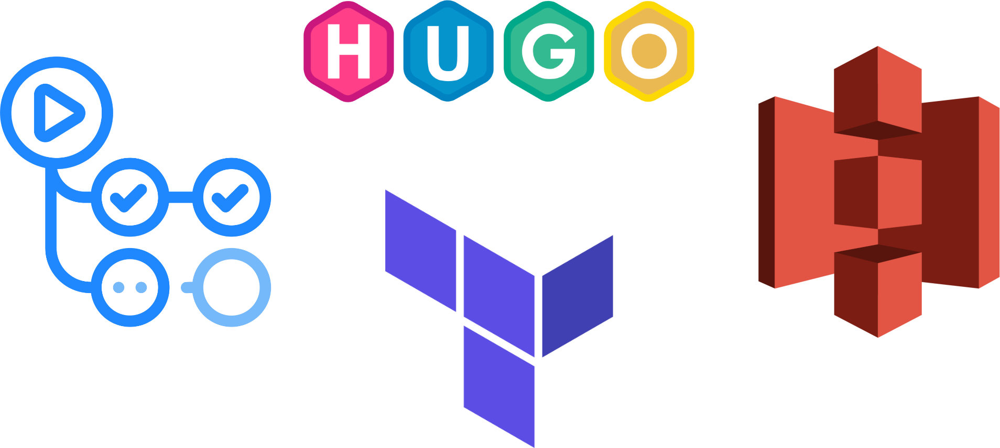
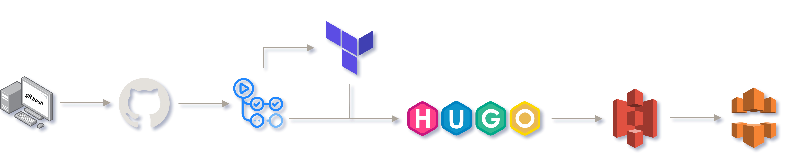

# **Proyecto Integrado**

  

**Tabla de contenidos**

- [**Proyecto Integrado**](#proyecto-integrado)
  - [**Información**](#información)
    - [**Título**](#título)
    - [**Descripción**](#descripción)
  - [**Tecnologías a utilizar**](#tecnologías-a-utilizar)
    - [**Amazon Web Services (AWS)**](#amazon-web-services-aws)
    - [**Terraform**](#terraform)
    - [**Hugo**](#hugo)
    - [**GitHub Actions**](#github-actions)
    - [**Resultados que se esperan obtener**](#resultados-que-se-esperan-obtener)
    - [**Precio**](#precio)
  - [**¿Por qué automatizar el despliegue de una web estática?**](#por-qué-automatizar-el-despliegue-de-una-web-estática)
  - [**Memoria**](#memoria)

## **Información**

### **Título**

Despliegue de una web estática - The GitOps Way.

### **Descripción**

El objetivo del proyecto es poner en funcionamiento una web estática utilizando un flujo de CI/CD de GitHub Actions que automáticamente despliegue la web sobre AWS a partir de los ficheros markdown que subiremos al repositorio. En concreto, los ficheros estáticos se encontrarán ubicados en un bucket de S3.

Este tipo de configuración se conoce como *serverless* ya que prescindimos completamente de tener una instancia/máquina sirviendo el contenido 24 horas al día de forma dedicada.

La infraestructura se gestionará utilizando Terraform.

## **Tecnologías a utilizar**

### **Amazon Web Services (AWS)**

- [Amazon Web Services](https://aws.amazon.com/es/) es un proveedor de servicios en la nube, ofrece almacenamiento, computación, bases de datos y un largo etcétera en lo referente a cloud computing.

A lo largo de este proyecto se utilizarán los siguientes servicios de AWS:

- **IAM**: [Identity and Access Management](https://aws.amazon.com/es/iam/) es un servicio que nos permite gestionar el acceso a los recursos de AWS de forma segura. Nos permitirá crear un usuario con permisos para gestionar los recursos que se van a crear, evitando, como recomiendan las buenas prácticas, utilizar el usuario root de la cuenta.

- **ACM**: [Amazon Certificate Manager](https://aws.amazon.com/es/certificate-manager/) nos permite gestionar certificados SSL/TLS para nuestros dominios.

- **S3**: [Amazon Simple Storage Service](https://aws.amazon.com/es/s3/) es un servicio de almacenamiento de objetos que ofrece escalabilidad, disponibilidad de datos, seguridad y rendimiento. Lo utilizaré para almacenar los ficheros estáticos de la web.

- **CloudFront**: [Amazon CloudFront](https://aws.amazon.com/es/cloudfront/) es un servicio de CDN (Content Delivery Network) que nos permite distribuir contenido a usuarios de todo el mundo con baja latencia y altas velocidades de transferencia. Será de utilidad para mejorar el rendimiento de la web y reducir el tiempo de carga. Aunque en este proyecto no se notará tanto su impacto debido a la poca cantidad de contenido que se va a servir, es conveniente explorar su funcionamiento para futuros proyectos más complejos.

- **AWS CLI**: [AWS Command Line Interface](https://aws.amazon.com/es/cli/) es una herramienta que nos permite interactuar con los servicios de AWS desde la línea de comandos. Para subir los ficheros estáticos a S3.

> Cabe mencionar que AWS dispone de diferentes ubicaciones (regiones) en las que se pueden desplegar los recursos. Mi infraestructura se ubicará en la región `us-east-1` (Norte de Virginia) ya que es la que ofrece el mayor número de servicios e integraciones.

### **Terraform**

- [Terraform](https://www.terraform.io/) es una herramienta de infraestructura como código (IaC) que nos permite crear, modificar y versionar la infraestructura de forma segura y eficiente en diferentes proveedores de servicios en la nube. En este proyecto se utilizará para crear la infraestructura necesaria en AWS.

### **Hugo**

- [Hugo](https://gohugo.io/) es un framework generador de sitios web estáticos (*el más rápido del mundo según su propia web*) escrito en Go. Me permitirá generar la web a partir de los ficheros markdown que subiré al repositorio de GitHub.

### **GitHub Actions**

- [GitHub Actions](https://github.com/features/actions) es un servicio de integración y entrega continua (CI/CD) que nos permite automatizar tareas. Será el encargado de detectar los cambios que se produzcan en el repositorio y ejecutar los pasos necesarios para generar y desplegar la web en AWS invocando en el proceso a Hugo, Terraform y AWS CLI.

### **Resultados que se esperan obtener**

La finalidad del proyecto sería contar con una página web y su infraestructura generada y desplegada de forma automática a partir de los ficheros que subamos al repositorio de GitHub.

Cualquier cambio que realicemos en el repositorio se verá reflejado en la web automáticamente.

### **Precio**

El proyecto está enfocado en la posibilidad de poner en funcionamiento una web estática (liviana) a coste cero, por lo que se usarán los tiers gratuitos de AWS ([lista de servicios gratuitos](https://aws.amazon.com/es/free/?all-free-tier.sort-by=item.additionalFields.SortRank&all-free-tier.sort-order=asc&awsf.Free%20Tier%20Types=*all&awsf.Free%20Tier%20Categories=*all)).

El único coste a tener en cuenta será el de registrar un dominio, que según el proveedor puede costarnos incluso menos de 2€ al año.

> Podríamos obtener un dominio con Route 53 evitando así salir del ecosistema de AWS, pero suele ser más caro que en otros proveedores (según disponibilidad y ofertas).

## **¿Por qué automatizar el despliegue de una web estática?**

La automatización de tareas es una práctica muy extendida en el mundo de la informática, y en concreto en la filosofía DevOps. Nos permite ahorrar tiempo y esfuerzo, además de reducir la posibilidad de cometer errores.

Por esto, es interesante comenzar a aprender con un proyecto a menor escala como este, que nos permitirá familiarizarnos con las tecnologías que se van a utilizar y servirá de base para proyectos más complejos.

## **Memoria**

La memoria completa del proyecto puede ser consultada en el siguiente enlace: [Despliegue de una web estática - The GitOps Way :: Blog de Juanje](https://www.juanje.eu/posts/memoria-pi/)

Todos los ficheros utilizados en el proyecto se encuentran en este repositorio.

---

✒️ **Documentación realizada por Juan Jesús Alejo Sillero.**
