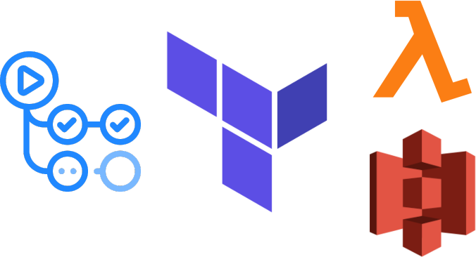

# **Preproyecto - Proyecto Integrado**

  

**Tabla de contenidos**

- [**Preproyecto - Proyecto Integrado**](#preproyecto---proyecto-integrado)
  - [**Información del proyecto**](#información-del-proyecto)
    - [**Título**](#título)
    - [**Descripción**](#descripción)
    - [**Tecnologías que se van a utilizar**](#tecnologías-que-se-van-a-utilizar)
    - [**Resultados que se esperan obtener**](#resultados-que-se-esperan-obtener)
    - [**Precio**](#precio)

## **Información del proyecto**

### **Título**

CI/CD serverless con GitHub Actions, Terraform y AWS

### **Descripción**

El objetivo del proyecto es desplegar una aplicación con frontend y backend utilizando un flujo de CI/CD de GitHub Actions que automáticamente realice pruebas y despliegue la aplicación sobre AWS.

El backend funcionará sobre AWS Lambda y el frontend se ubicará en un bucket S3.

Este tipo de configuración se conoce como *serverless* ya que prescindimos completamente de tener una instancia/máquina sirviendo el contenido estático y ejecutando el código del backend de forma dedicada.

La infraestructura se gestionará utilizando Terraform.

El uso de Lambda + S3 nos permite tener una aplicación que se puede escalar de forma automática y que no tiene coste alguno mientras no se esté utilizando, además de que para aplicaciones pequeñas es mucho más económica esta combinación que utilizar instancias EC2.

### **Tecnologías que se van a utilizar**

Amazon Web Services (AWS), Terraform, GitHub Actions, lenguajes varios para el frontend y backend de la aplicación.

### **Resultados que se esperan obtener**

Podríamos tener por ejemplo, una aplicación web que redimensione imágenes.

Funcionaría del siguiente modo:

1. Accedemos a la web

2. Subimos nuestra imagen

3. La imagen se envía al bucket de S3

4. Tras subirse, Lambda detecta el nuevo objeto y se ocupa de redimensionar la imagen

5. La imagen editada se sube a S3

6. Finalmente, la web mostraría la imagen redimensionada permitiendo descargarla

Además, gracias al apartado de CI/CD del proyecto, si cambiamos el código de la aplicación, se realizarán las pruebas pertinentes y se desplegará la nueva versión de forma autónoma.

La aplicación que finalmente se despliegue puede variar ya que lo presentado en este documento es preliminar.

### **Precio**

El proyecto está enfocado en la posibilidad de poner en funcionamiento una aplicación (liviana) con frontend y backend a coste cero, por lo que se usarán los tiers gratuitos de AWS ([lista de servicios gratuitos](https://aws.amazon.com/es/free/?all-free-tier.sort-by=item.additionalFields.SortRank&all-free-tier.sort-order=asc&awsf.Free%20Tier%20Types=*all&awsf.Free%20Tier%20Categories=*all)).

---

✒️ **Documentación realizada por Juan Jesús Alejo Sillero.**
